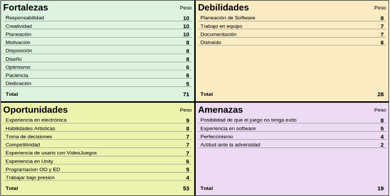
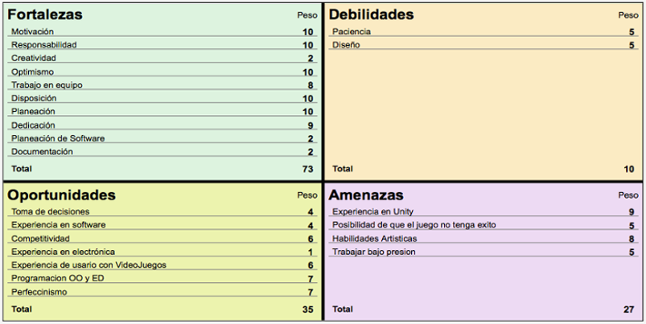
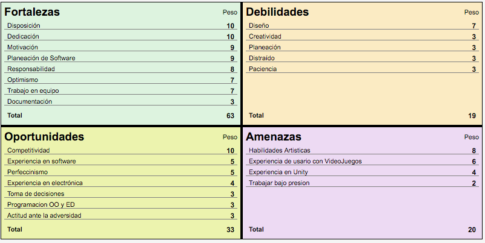
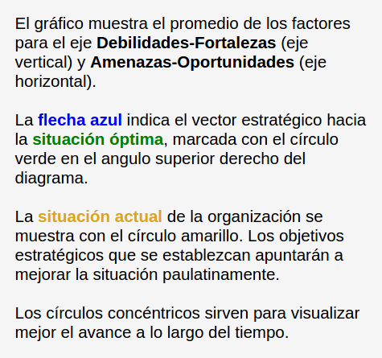
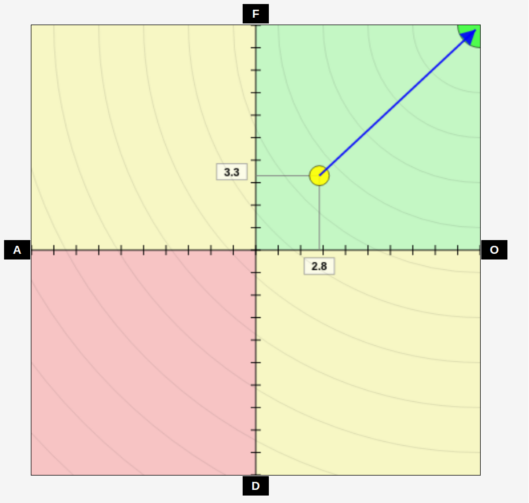
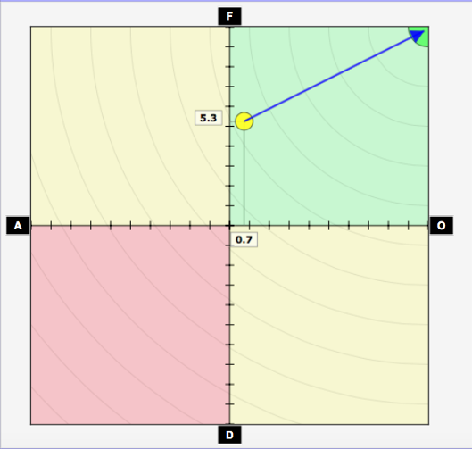
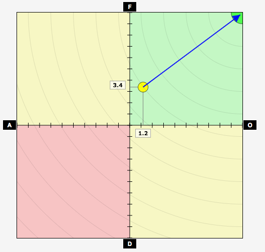

# **Introduccion**

La industria de los videojuegos es enorme. 
Es por eso que en ella podemos encontrar una serie de roles y de funciones muy 
extensa, pues realizar uno no es una tarea sencilla. Es por eso que por ahí
dicen que si quieres hacer dinero debes de hacer software, pero si quieres 
hacer mucho dinero debes de hacer videojuegos.

# **Desarrollo**

Antes de poder pensar en 
generar económicamente se debe de tomar en cuenta que se debe de contar con un 
equipo que cumpla los siguientes roles con sus respectivas funciones:

##### Responsabilidades y compromisos de un equipo de desarrollo de software
 
>#### Diseño Visual
>
>-  Tech Artists: 
>   -  Encargarse del flujo de trabajo de la producción artística y de los posibles problemas que pueden surgir.  
>-  Artista: 
>   -  Crea bocetos y esquemas de color de los mundos, personajes, vehículos, etc.
>- Animator: 
>   -  Representación del movimiento y el comportamiento del proyecto
>
>
>#### Diseño del Juego
>
>- Game Designer: 
>   -  Formula el concepto del juego 
>   -  Idear un juego consiste
>   -  Planearla jugabilidad
>   -  Definir los elementos centrales.
>- Level Designer:
>  - Crea la estructura del nivel según el documento de diseño
>  - Definir y crear arquitectura interactiva para un segmento del juego: paisajes, edificios y objetos.
>  
>
>#### Programación
>
>- Programadores:
>  - Diseñan cuestiones técnicas del juego.
>  - Escriben el código que controla el juego
>  - Incorpora y adapta las partes hechas. 
>- Game Programmer:
>  - Diseñar y escribir código para controlar el juego
>- Lead Programmer:
>  - Líder del equipo de programación que está generando el código.
>- Database Administrator:
>  - Especialista en modelación, diseño y creación de bases de datos usadas por el proyecto
>
>
>#### Audio
>
>- Ingeniero de Audio:
>  - Crea efectos de sonido
>  - Grabación , producción y composición musical.
>  - Dirigir el doblaje de ser necesario
>  - Crear el soundtrack del juego, música, efectos, voces de personajes y otros.
>  
>#### Liderazgo
>
>- Productor:
>  - Administrador de proyecto
>  - Encargarse de la entrega exitosa del juego a tiempo
>  - Controlar recursos financieros
>  - Monitorear calendario
>  - Asignar roles de trabajo al equipo
>  - Dirigir al equipo de trabajo
> 
>- Asistente del procuctor
>  - Dar seguimiento a los milestones
>  - Dar seguimiento de las minutas
>  - Resolver problemas de primer grado
> 
>#### Testing
>- Quality Assuarace y Testers:
>  - Probar los juegos de manera sistemática. 
>  - Analizar rendimiento del juego
>  - Identificar problemas y sugerir mejoras. 
>

#### Análisis Foda

Cuando se trabaja en equipo, se debe de realizar un análisis para concer a
cada integrante del mismo, pues se deben de aprovechar las cualidades 
de cada quién para que el desarolllo sea todavia más efectivo. A continuación se
presenta un análisis de las fortalezas,
oportunidades, debilidades y amenzas de cada miembro del equipo. 

##### Humberto

##### Sergio

##### Ana Karen

#### Áreas de Oportunidades

En cualquier equipo de trabajo, es necesario entender las caulidades y áreas de oportunidad de una persona, por lo mismo se debe trazar una forma de trabajo en la que se pueda impulsar su desempeño.
Para esto, mostramos el gráfico de progreso sugerido de acuerdo al Foda de los integrantes:

##### Humberto

##### Sergio

##### Ana Karen

----------------------
**Nuestro Desarrollo**

De acuerdo a los roles definidos por todos los integrantes del equipo y 
a las habilidades de cada quién, se llegó
a la conclusión de que estos eran los roles que más se apegaban a nuestra 
empresa:

| Diseño Visual | Ana Karen | Humberto | Sergio |
| ------------------|:---------:|:--------:|-------:|
| Producción Artística | 0 | 70 | 30  |
| Bocetos y esquemas de color | 0 | 90 | 10 |
| Movimientos y comportamientos | 0 |50  | 50 |
| **Diseño del juego**|
| Formular concepto del juego | 1/3 | 1/3 | 1/3  |
| Planear jugabilidad | 1/3 | 1/3 | 1/3 |
| Definir elementos centrales | 1/3 | 1/3 | 1/3  |
| Estructura de niveles | 1/3 | 1/3 | 1/3  |
| Arquitectura interactiva | 1/3 | 1/3 | 1/3  |
| **Programacion**|
| Diseño técnico | 0 | 50 | 50  |
| Generar código de control | 0 | 50 | 50 |
| Incorporacóin y adaptación | 0 |50  | 50 |
| Supervisión| 100 |0  | 0 |
| **Audio**|
| Efectos de sonido | 0 | 50 | 50  |
| Producción musical | 0 | 50 | 50 |
| Voces/doblaje | 0 |50  | 50 |
| Soundtrack | 0 |50  | 50 |
| **Liderazgo**|
| Administrar proyecto | 0 | 0 | 100  |
| Verificar la entrega | 1/3 | 1/3 | 1/3 |
| Monitorear calendario | 10 |10  | 80 |
| Asignar roles de trabajo al equipo | 10 |10  | 80 |
| Dar seguimiento a los milestones | 100 |0  | 0 |
| Dar seguimiento a las minutas | 100 |0  | 0 |
| Resolver problemas de primer grado | 100 |0  | 0 |
| **Testing**|
| Probar los juegos de manera sistemática | 1/3 | 1/3 | 1/3  |
| Planear jugabilidad | 1/3 | 1/3 | 1/3 |
| Analizar rendimiento del juego | 1/3 | 1/3 | 1/3  |
| Identificar problemas y sugerir mejoras | 1/3 | 1/3 | 1/3  |

**Conclusión**
---
Siendo una empresa desarrolladora de videojuegos decidimos asignar roles de trabajo
entre los miembros. Los roles nos ayudarán a poder desarrollar el producto que el cliente
busca, de la mejor manera. Los roles y compromisos que acordamos tener y seguir en 
la empresa serán la base de un excelente trabajo pues estaremos cubriendo y pensando en 
todos los aspectos del producto.

-------------------
**Minuta**
-------------------
- Asistentes: Humberto, Sergio, Ana Karen 
- Fecha: 16/marzo/2016
- Hora de inicio: 10:30 am
1. Se definio el nombre de la empresa. (Left & Right)
2. Se definio un slogan: "Whatever you like"
3. Se definieron los roles de equipo.
4. Se genero el documento de entrega 1 "trabajo en equipo".
5. Acordamos en usar cloud9 para trabajar.
- La junta termino a la 1:30 pm

-------------------
**Coevaluación**

| Evaluador (abajo) | Ana Karen | Humberto | Sergio |
| ------------------|:---------:|:--------:|-------:|
| **Ana Karen** | 100 | 100 | 100  |
| **Humberto** | 100 | 100 | 100 |
| **Sergio** | 100 | 100 | 100 | 
