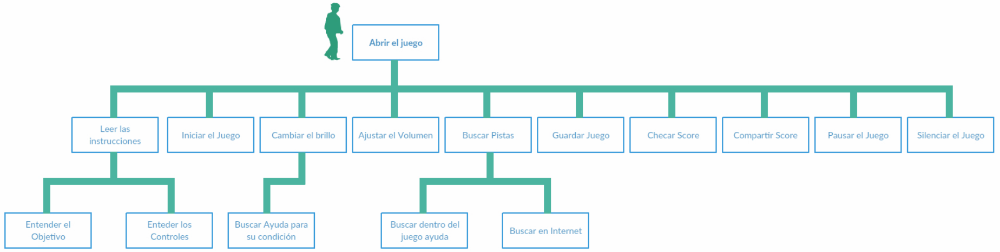
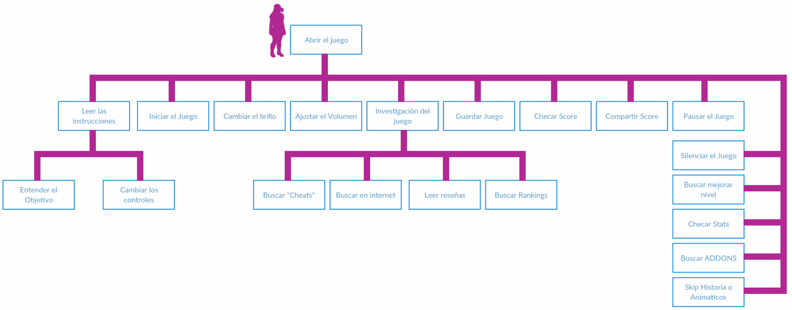
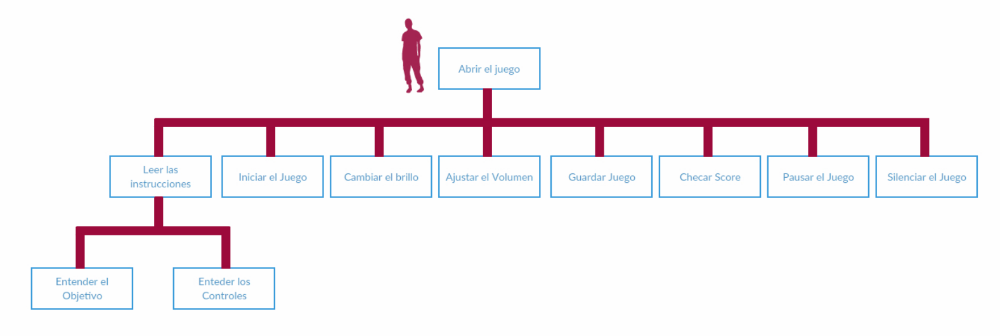
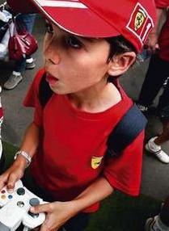
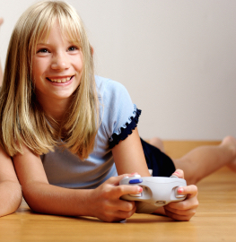
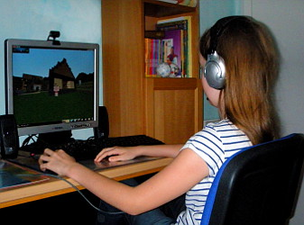
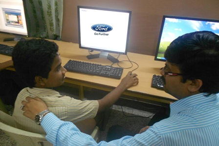

<h1> Análisis </h1>
- Humberto Garza A00808689
- Ana Karen Beltrán A01192508 (Secretaria)
- Sergio Díaz A01192313 (Líder)

<h2> Introducción </h2>
En este trabajo se llevará a cabo un análisis de los usuarios que se 
entrevistaron en la escuela Ciudad de los Niños. En base a eso, se elaboraran 
perfiles de usuarios y con ellos se hará el diseño de tres personas en base a 
dichos perfiles. También se elaborará un estudio de las taras que los usuarios
llevan a cabo usando el análisis jerárquico de tareas. Por último se hará una 
descripción del medio ambiente en el cual los usuarios van a interactuar con 
nuestro sistema computacional. 

**Trabajo Individual**
---

**Ana Karen**
###### Perfiles de usuarios
* Apasionado por los videojuegos
    * Le es fácil jugar y entender por primera vez los juegos
    * Le encantan los juegos retadores
    * Puede pasar mucho tiempo jugando
    * Quiere seguir avanzando y superarse en el juego.
* No le gustan los videojuegos
    * No le llaman la atención los juegos
    * No tiene experiencia jugando
    * Si no conoce el juego, batalla en entender como funciona
* Alumno Reprobado
    * Asiste a pocas clases
    * Tiene muy malas calificaciones
    * No entiende los temas
    * No puede hacer las taras y trabajos
    * Va reprobando
    * Quiere entender los temas
* Alumno Condicionado
    * Asiste a las clases
    * No tiene tan buenas calificaciones
    * Le es complicado entender los temas
    * Batalla al hacer las tareas y trabajos
    * Esta cerca de reprobar
    * Quiere practicar y entender mejor, los temas
* Alumno Calificaciones Altas
    * Asiste a las clases
    * Participa
    * Entiende el contenido de la clase
    * Hace los trabajos y tareas demostrando un buen desempeño
    * Tiene buenas calificaciones 
    * Quiere practicar, los temas
    
###### Puntos importantes del artículo
* Simplicidad > Complejidad 
* Ver lo que la gente realmente hace (sus acciones), no creen lo que dicen que hacen 
* Usabilidad de manera correcta: 
  * evitar misguidances 
  * crear varios diseños y obtener retroalimentación con uso real 
  * (Evitar menús desplegables) 
* Fácil de usar & efectivo
*Hablar con usuarios: 
  * dicen lo que piensan que quieres escuchar (biass). 
  * No recuerdan detalles. 
  * Sugieren soluciones. (you just care about the problem/issue)

--------
**Sergio**

**Perfiles:**

**Niño que le gustan los videojuegos**
- 9-12 años
- Le gustan los retos
- Sabe que videojuegos le gustan
- Tiene plataforma favorita 
- Sabe distinguir de un juego bueno y un juego malo

**Niño que no sabe de videojuegos**
- 9-12 años
- Le gustan actividades en el exterior
- Le gusta estudiar
- Le gustan actividades como leer
- No sabe mucho sobre el mundo digital

**Niño que no acostumbra jugar videojuegos**
- 9-12 años
- Juega cuando tiene tiempo o antoja
- Sabe entablar una conversación sobre el tema de videojuegos
- Sabe usarlos después de haber interactuado poco tiempo con el juego
- No se clava fácilmente en el juego

**Niña que no le gusta la tecnología**
- 9-12 años
- No sabe que pasa cuando ve un juego
- Si juega, no le es fácil aprender los controles 
- Prefiere hacer otra cosa
- Puede tener otros hobbies
- Le gusta el exterior

**Maestro que busca herramientas didácticas para complementar su enseñanza**
- No es muy hábil computacionalmente 
- Le interesan sus alumnos
- Le apasiona su vocación
- Cree en diferentes métodos de enseñanza
- Es un maestro abierto

**Mis ideas del artículo "First rule of usability?: Dont't listen to users"**
-	Observar lo que realmente hacen las personas.
-	No creerse del todo lo que las personas dicen que hacen.
-	No creer en lo que las personas predicen que a lo mejor van a hacer en el futuro. 

--------
**Humberto**

###### Perfiles de usuarios

| Perfiles de usuarios | Estudiantes de Primaria | Estudiantes de Secundaria | Personas con dispacidad psicológica |
| ------------------|:---------:|:--------:|:-------:|
| **Nivel de inglés** | Bajo | Medio | Variable  |
| **Conocimientos generales** | Básico | Medio | Promedio-Trunca |
| **Habilidad tecnológica** | Medio | Medio-Alto | Promedio-Nula | 
| **Experiencia con videjo Juegos** | Medio-Alta | Alto | Variable-Baja | 
| **Nivel de concentración** | Bajo | Medio | Bajo | 

--------

<h1> Perfiles de usuario: </h1>

<h2> Estudiante daltónico </h2>
    
    - Edad: 9-12
    
    - Sexo: hombre
    
    - No distingue la gama de colores a la perfección. Confunde colores.
    
    - No le gusta hablar sobre su padecimiento.
    
    - Se aburre facilmente, ya que el juego no capta su atención.
    
#### Análisis jerárquico de tareas (HTA)

----------------

<h2> Estudiante que le gustan los videojuegos </h2>
   
    - Edad: 9-12
    
    - Le gustan los retos.
    
    - Le llama la atención los efectos de sonido en un juego.
    
    - Sabe distinguir su estilo preferido de juegos.
    
    - Esta acostumbrado a ciertos controles.

#### Análisis jerárquico de tareas (HTA)

----------------

<h2> Estudiante que no acostumbra jugar videojuegos </h2>
    
    - Edad: 9-12
    
    - Le gustan otras actividades como la lectura
    
    - Se estresa facilmente pues no le encuentra el punto al juego
    
    - No tiene experiencia, por lo tanto se siente perdido. No se percata de lo 
      que sucede.
    
    - No es hábil con los controles.

#### Análisis jerárquico de tareas (HTA)

----------------

<h1> Diseño de personas: </h1>

 
 **Nombre:** Manuel Flores
 
 **Edad:** 11 años
 
 **Sexo**: Masculino
 
 Manuel Flores es un estudiante de 6to de primaria, es daltónico y su pasatiempo
 favorito es jugar videojuegos llamativos. También le gusta jugar basketball. 
 
 **Nivel de experiencia:** Le gusta jugar videojuegos, después de jugar un rato 
 Manuel lográ sumergirse en el juego y usa sus habilidades al máximo para avanzar
 en el videojuego.
 
 **Contexto:** 
 Manuel jugará el videojuego por voluntad propia, pues le entretienen los juegos.
 Para tener una mejor experiencia Manuel jugará en de una desktop, durante sus 
 tiempos libres (aproximadamente una vez a la semana).
 
 **Objetivos:**
 Hacer que Manuel se sumerga en el juego sin que su daltonismo sea una limitante.
 
 **Amenazas:**
 Que Manuel deje de jugar el videojuego por cuestiones de su daltonismo.

---

 
 **Nombre:** Marielle Urquiza
 
 **Edad:** 12 años
 
 **Sexo**: Femenino
 
 Marielle Urquiza es una estudiante inquieta de primero de secundaria. Le gusta 
 mucho la música y su más grande pasión es jugar videojuegos de peleas (box). 
 
 **Nivel de experiencia:** Marielle es una experta. LLeva jugando videojuegos 
 desde tercero de primaria y ha jugado prácticamente todo, incluyendo juegos de 
 historia, de primera y tercera persona. Su plataforma favorita es el xbox. 
 
 **Contexto:** 
 Marielle jugará el videojuego por gusto hasta que este no represente un reto 
 para ella. Si el videojuego es lo suficientemente bueno para ella, se va a 
 hacer adicta a el. A pesar de que a ella le gusta jugar en xbox, 
 también es abierta a jugar videjuegos Desktop. 
 
 **Objetivos:**
Hacer que a Marielle le encante el juego y represente un reto para ella.
 
 **Amenazas:**
Que Marielle no sienta que el juego no es lo suficientemente es retador o 
 entretenido para cautivar su atención.
 

 ---

 
 **Nombre:** Javier Gutierrez
 
 **Edad:** 9 años
 
 **Sexo**: Masculino
 
 Javier Gutierrez es un estudiante de 4to grado. Esta involucrado en muchas 
 actividades en su escuela y le dedica mucho tiempo al estudio, por lo tanto no
 tiene tiempo para jugar videjuegos o ver televisión.
 
 **Nivel de experiencia:** Debido a que Javier no acostumbra jugar videojuegos, 
 no es muy habilidoso con lo controles. Le cuesta trabajo adapatarse facilmente
 al juego, es por eso que cuando tiene la oportunidad de jugar, no lo hace 
 por un tiempo prolongado. 
 
 **Contexto:** 
 Javier jugará cuando este aburrido y no tenga que hacer, por lo tanto juagrá
 muy poco. Los videjuegos no son tanto de su agrado, pero jugará en su Desktop,
 si tiene el tiempo para ello.
 
 **Objetivos:**  
Hacer que a Javier le guste el juego en poco tiempo
 
Hacer el juego para que Javier pueda jugarlo aunque no disponga de mucho tiempo
 
 **Amenazas:**  
Que javier no tenga tiempo de jugar.
 
Hacer que el juego no sea atractivo para Javier.
 
Que los controles o la curva de aprendizaje del juego no sea del agrado del usuario. 
 
---
<h1> Medio ambiente </h1>

**Casa:**

El usuario juagrá el juego en una computadora Windows en su casa. El usuario no 
tendra una buena connexión de internet y no contará con un sistema de sonido 
avanzado. El usuario estará sentado mientras interactua con el juego, normalmente
jugará en sus tiempos libres (tarde o noche).

**Salón de clases:**

El usuario jugará en el salón de clases para practicar los contenidos de clase.

El salón es un laboratorio de computadoras donde varios estudiantes estarán 
jugando al mismo tiempo, cada quien en una Desktop. Es probable que no se tenga 
una buena connexión de internet.

---
<h1> Métricas de Usabilidad </h1>

---
**Nombre del objetivo:** Eficiencia

**Métrica:** Número de clicks que el usuario tarda en emezar a jugar.

**Método de medición:** Contar el número de clicks para iniciar el juego.

**Nivel actual:** NA (es nuevo)

**Nivel planeado:** 3 clicks.

**Mejor caso:** 1 click.

**Peor caso:** 3 clicks

---
**Nombre del objetivo:** Fácil de recordar

**Métrica:** El usuario logra jugar sin ver el tutorial, una segunda vez.

**Método de medición:** Después de usar el juego por primera vez, contar cuantas
veces se ve el tutoria.

**Nivel actual:** NA (es nuevo)

**Nivel planeado:** Ve el tutorial una vez más.

**Mejor caso:** No ve el tutorial.

**Peor caso:** Ve el tutorial una vez más.

---
**Nombre del objetivo:** Facilidad de Aprendizaje (learnability)

**Métrica:** El juego es lo suficientemente fácil de usar.

**Método de medición:** Número de veces que el usuario ve el tutorial.

**Nivel actual:** NA (es nuevo)

**Nivel planeado:** Una vez.

**Mejor caso:** Ninguna vez.

**Peor caso:** Una vez.

---
**Nombre del objetivo:** Utilidad

**Métrica:** Tiempo que el usuario usa el juego. 

**Método de medición:** Contador, marcando el avance de niveles.

**Nivel actual:** NA (es nuevo)

**Nivel planeado:** Que complete por lo menos un nivel.

**Mejor caso:** Que termine el juego.

**Peor caso:** Que complete por lo menos un nivel.

---
**Nombre del objetivo:** Facilidad de Aprendizaje (learnability)

**Métrica:** El usuario puede jugar sin hacer click en el botón de "ayuda".

**Método de medición:** Contar las veces en que el usuario hace click en "ayuda".

**Nivel actual:** NA (es nuevo)

**Nivel planeado:** Hace click una vez.

**Mejor caso:** No hace click.

**Peor caso:** Hace click una vez.

---
<h2>Conclusión</h2>
El desarrollo de videojuegos debe estar orientado a sus posibles usuarios, pues 
ellos serán quienes estarán interactuando con el juego. Para que nuestro producto 
final cumpla con las expectativas de nuestros usuarios: definimos perfiles  y 
diseñamos personas. La descripción de las personas define a detalle lo que 
buscan y quieren nuestros usuarios más importantes en este caso los estudiantes 
de primaria y secundaria de la escuela Ciudad de los Niños. El modelo HTA que se
generó, nos ayudará a la hora del desarrollo, pues hemos identificado las tareas
más importantes para cada tipo de usuario. Al momento de planear la arquitectura
y el diseño del juego en general estaremos basándonos en las métricas de 
usabilidad que definimos. Tal y como lo menciona el artículo de Nielsen, lo que
hace a un sistema excelente es que sea simple y fácil de usar, por lo tanto 
nuestras métricas van dirigidas al desempeño que tendrán los estudiantes cuando 
estén jugando.

**Referencias**
---
"Personas Make Users Memorable for Product Team Members." Personas Make Users Memorable for Product Team Members. N.p., n.d. Web. 30 Mar. 2016. <https://www.nngroup.com/articles/persona/>.

Preece, J., Rogers, Y., & Sharp, H. (2002). Interaction design: Beyond
human-computer interaction. New York, NY: J. Wiley & Sons.

Nielsen, J., and Levy, J. (1994). Measuring usability — preference vs. 
performance. Communications of the ACM 37, 4 (April), 66-75. <https://www.nngroup.com/articles/first-rule-of-usability-dont-listen-to-users/>

---

**Coevaluación**

| **Humberto** | Responsabilidad de elaborar act. previa | Puntualidad | Cantidad de trabajo | Calidad de trabajo | Interés | Colboración (dar y recibir) | Espíritu de ayuda | Cumplimiento de compromiso |
| ------------------|:---------:|:--------:|:-------:|:-------:|:-------:|:-------:|:-------:|:-------:|
| **Ana Karen** | 100 | 100 | 100  | 100 | 100 | 100  | 100 | 100   |
| **Humberto**| 100 | 100 | 100  | 100 | 100 | 100  | 100 | 100   |
| **Sergio** | 100 | 100 | 100  | 100 | 100 | 100  | 100 | 100   |

 

| **Sergio** | Responsabilidad de elaborar act. previa | Puntualidad | Cantidad de trabajo | Calidad de trabajo | Interés | Colboración (dar y recibir) | Espíritu de ayuda | Cumplimiento de compromiso |
| ------------------|:---------:|:--------:|:-------:|:-------:|:-------:|:-------:|:-------:|:-------:|
| **Ana Karen** | 100 | 100 | 100  | 100 | 100 | 100  | 100 | 100   |
| **Humberto**| 100 | 100 | 100  | 100 | 100 | 100  | 100 | 100   |
| **Sergio** | 100 | 100 | 100  | 100 | 100 | 100  | 100 | 100   |

 

| **Ana Karen** | Responsabilidad de elaborar act. previa | Puntualidad | Cantidad de trabajo | Calidad de trabajo | Interés | Colboración (dar y recibir) | Espíritu de ayuda | Cumplimiento de compromiso |
| ------------------|:---------:|:--------:|:-------:|:-------:|:-------:|:-------:|:-------:|:-------:|
| **Ana Karen** | 100 | 100 | 100  | 100 | 100 | 100  | 100 | 100   |
| **Humberto**| 100 | 100 | 100  | 100 | 100 | 100  | 100 | 100   |
| **Sergio** | 100 | 100 | 100  | 100 | 100 | 100  | 100 | 100   |

<h1> Minuta </h1>

General
---
- Asistentes: Sergio, Ana Karen y Humberto (virtual) 
- Fecha: 29/marzo/2016
- Hora de inicio: 5:00 pm
- La primera parte de la junta terminó a la 8:30 pm
- Fecha: 30/marzo/2016
- Hora de inicio: 10:30 pm
- La junta terminó a las 1:30 pm

Acuerdos
---
- Se llegó a un acuerdo en cuanto a los perfiles de usuarios de su sistema.

- Se generó el diseño de personas para cada uno de los perfiles que listaron. 

- Se analizaron las tareas que los usuarios llevan a cabo usando el análisis 
jerárquico de tareas (HTA) de manera gráfica.

- Se hizo una descripción del medio ambiente en el cual los usuarios 
interactuarán con el sistema computacional.

- Se subieron los documentos al área de colaboración.

- Se hizo la coevaluación correspondiente

